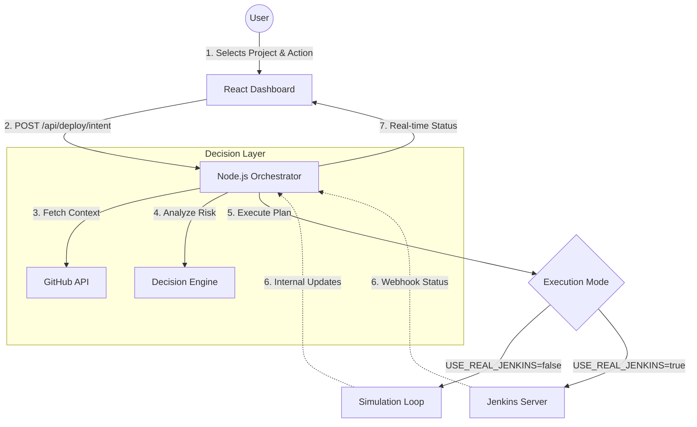

# CiGenie - AI-Assisted CI/CD Orchestrator

**CiGenie** is an intelligent control plane that sits above your Jenkins infrastructure. It abstracts the complexity of CI/CD pipelines, offering an intent-based interface ("Deploy to Production") rather than a parameter-based one.

 

## 🏗️ System Architecture

The system is designed as an Orchestrator Pattern. The Node.js backend acts as the "Brain", making decisions and delegating execution to Jenkins (the "Worker").



## 🧩 Key Components

### 1. Decision Engine (`server/services/decisionService.js`)
*   **Role**: The "AI" component (currently rule-based, ready for LLM).
*   **Function**: Receives user intent (e.g., "Rollback"), analyzes context (Env=Production), and generates an **Execution Plan**.
*   **Output**: A JSON plan containing the `JenkinsJobName`, `Parameters`, `RiskFlags`, and `ConfidenceScore`.

### 2. Deployment Controller (`server/controllers/deploymentController.js`)
*   **Role**: The traffic cop.
*   **Function**: Coordinates the flow. It fetches projects, asks the Decision Engine for a plan, and triggers execution.
*   **Execution Modes**:
    *   **Simulation**: Updates an in-memory execution record to mimic a build (useful for dev/demo).
    *   **Real**: Calls the Jenkins REST API to trigger a real pipeline.

### 3. GitHub Service (`server/services/githubService.js`)
*   **Role**: Project Discovery.
*   **Function**: Dynamically fetches your repositories from GitHub to populate the project list. No manual configuration required.

### 4. Jenkins Service (`server/services/jenkinsService.js`)
*   **Role**: The Driver.
*   **Function**: Wraps `axios` calls to interact with your Jenkins instance (Trigger Build, Get Logs, Get Status).

## 🚀 Data Flow

### Deployment Flow
1.  **Discovery**: On startup, `GithubService` fetches your repos and stores them in `store.js`.
2.  **Intent**: User clicks "Deploy" on the UI.
3.  **Analysis**: `DecisionService` checks if "Deploy" is allowed on "Production". It might add a `RiskFlag` ("High Risk").
4.  **Approval**: The UI shows a summary. User clicks "Approve".
5.  **Trigger**: `DeploymentController` sends a request to Jenkins:
    ```http
    POST http://jenkins:8080/job/my-repo/buildWithParameters
    DATA: { ACTION: "deploy", ENV: "prod" }
    ```
6.  **Monitoring**: The backend polls Jenkins or waits for a Webhook to update the status in `store.js`.

## 📂 Project Structure

```
CiGenie/
├── client/                 # React Frontend
│   ├── src/
│   │   ├── components/     # UI Components (ActionPanel, etc.)
│   │   ├── pages/          # Dashboard Views
│   │   └── services/       # API Clients
│   └── ...
├── server/                 # Node.js Backend
│   ├── controllers/        # Route Handlers
│   ├── models/             # In-Memory Database (store.js)
│   ├── routes/             # API Definitions
│   ├── services/           # Business Logic (GitHub, Jenkins, Decision)
│   ├── index.js            # Entry Point & Logging Middleware
│   └── .env                # Config (GitHub/Jenkins credentials)
└── ARCHITECTURE.md         # This file
```

## 🛠️ Setup & Configuration

### Prerequisites
*   Node.js & npm
*   (Optional) Jenkins Instance

### Environment Variables (`server/.env`)
```env
PORT=4000
GITHUB_USERNAME=your_user

# Jenkins Integration
USE_REAL_JENKINS=false  # Set to true to enable real builds
JENKINS_URL=http://localhost:8080
JENKINS_USER=admin
JENKINS_TOKEN=your_token
```

### Running the App
1.  **Backend**: `cd server && npm start`
2.  **Frontend**: `cd client && npm run dev`

## 🔮 Future Roadmap (AI Integration)
*   Integrate **Gemini/OpenAI** into `decisionService.js` to parse natural language execution logs and suggest fixes for failed builds.
*   Use LLMs to convert natural language intents ("Deploy the hotfix from last night") into precise Git branches and Jenkins parameters.
