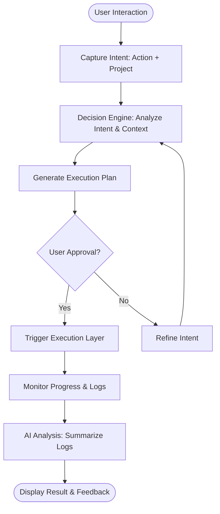
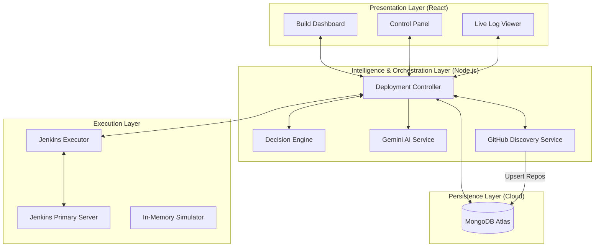
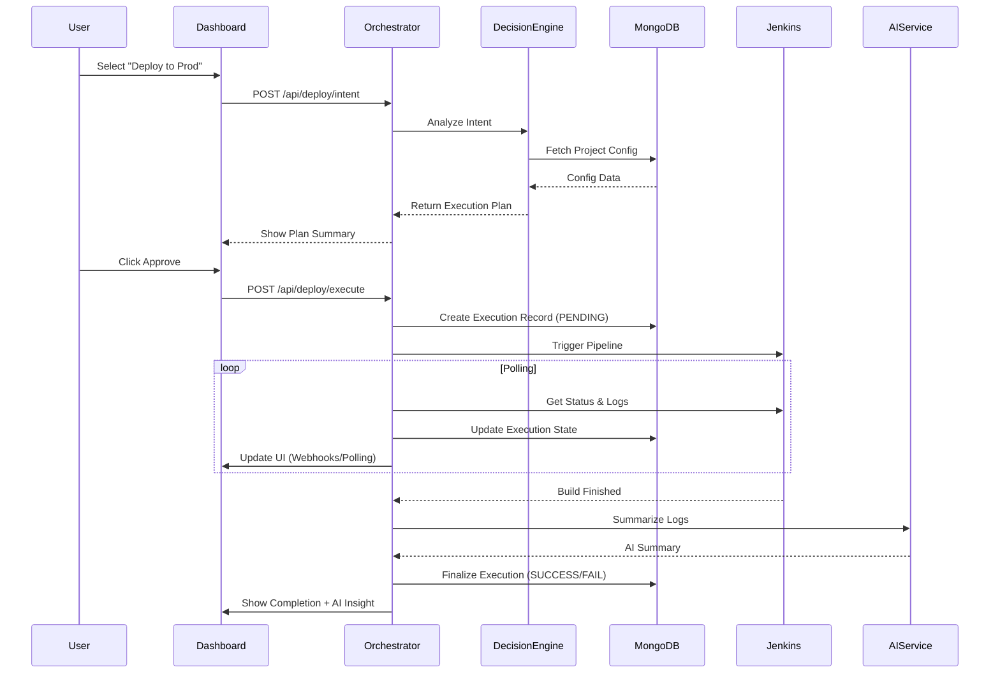

# CiGenie System Design & Methodology

This document provides a comprehensive overview of the CiGenie architecture, methodology, and detailed module designs.

---

## 🛠️ Project Methodology

CiGenie follows an **Intent-Based Backend Orchestration** methodology. The core philosophy is to abstract the complexities of CI/CD infrastructure (Jenkins, Docker, Cloud) behind a natural or intent-based interface.

### Methodology Flowchart

---

## 🏗️ System Architecture

CiGenie is built as a **Distributed Orchestrator**. It separates the "deciding" (Backend) from the "doing" (Jenkins) using a state-driven approach powered by **MongoDB Atlas**.

---

## 🧩 Module Breakdown & Detailed Design

### 1. Decision Engine (`decisionService.js`)
*   **Role**: Contextual Intent Analysis.
*   **Responsibilities**:
    *   **Intent Resolution**: Translates user actions (e.g., "Deploy") into technical parameters (e.g., `ACTION=deploy`, `ENV=production`).
    *   **Context Awareness**: Checks project types and target environments to apply specific rules or risk flags.
    *   **Execution Strategy**: Determines if the plan can be auto-executed or requires explicit human approval.

### 2. AI Summarization Service (`aiService.js`)
*   **Role**: Intelligent Log Parser.
*   **Implementation**: Integrates with **Google Gemini Flash** via the `@google/generative-ai` SDK.
*   **Workflow**:
    1.  **Ingestion**: Receives streaming or final logs from a Jenkins build.
    2.  **Preprocessing**: Truncates logs to avoid token overflow while maintaining the "tail" context.
    3.  **Inference**: Prompts Gemini to identify "What happened?", "Why did it fail?", and "How to fix it?".
    4.  **Feedback**: Returns a structured JSON summary displayed on the dashboard.

### 3. Deployment Controller (`deploymentController.js`)
*   **Role**: State Machine & Traffic Control.
*   **Logic Flow**:
    1.  Handles REST endpoints for all deployment-related activities.
    2.  **Validation**: Performs pre-flight checks (e.g., verifying `test` scripts via GitHub API).
    3.  **State Management**: Records every execution in the **MongoDB** database.
    4.  **Worker Management**: Triggers Jenkins jobs, handles auto-creation of missing jobs, and polls for real-time status updates.

### 4. GitHub Service (`githubService.js`)
*   **Role**: Project Discovery & Automated Onboarding.
*   **Features**:
    *   Retrieves all accessible repositories for the configured user.
    *   Syncs local state with GitHub (default branches, clone URLs).
    *   Inspects repository structure to provide automated configuration suggestions.

### 5. Execution Layer (`jenkinsExecutor.js`)
*   **Role**: Low-level Infrastructure Driver.
*   **Interface**: Wraps the Jenkins REST API using `axios`.
*   **Key Functions**:
    *   `triggerBuild`: Parameterized build triggering.
    *   `getBuildLogs`: Log retrieval for live streaming.
    *   `createJob`/`updateJob`: Dynamic Pipeline-as-Code (Groovy) management.

---

## 📊 Data Design

### Persistence Model (`models/`)
*   **Engine**: MongoDB Atlas via Mongoose.
*   **Collections**:
    *   **Projects**: Stores GitHub metadata and Jenkins job linking.
    *   **Executions**: History of all builds, including logs, status, and AI summaries.
    *   **Config**: System-wide settings (API keys, Jenkins credentials).

---

## 🚀 System Design Workflow

